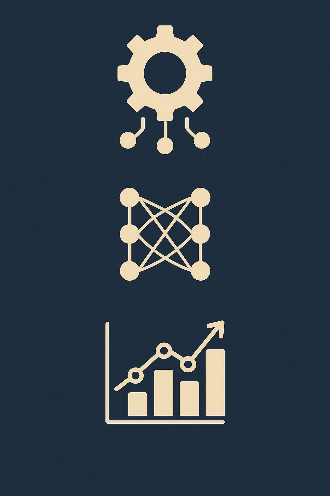

# Hey 👋, I’m **Pablo Reyes**!

  
  
  

<!-- Skills -->

  
  
  
  

---

## 👨‍💻 About Me

Economist turned Data Scientist focused on **Machine Learning, Bayesian Econometrics, Time-Series Analysis, and Graph Theory**.  
I apply advanced ML and econometric methods to analyze and forecast economic systems, from **structural BVARs** to **graph-theoretic network models**.  
Always open to collaborating on impactful, data-driven research.

---

## 🔧 Core Strengths

- **ML & DL in Economics**: Forecasting, interpretability, and policy impact modeling  
- **Bayesian Econometrics**: BVARs, SGDLMs, structural identification  
- **Graph Theory in Economics**: Network centrality, contagion modeling, trade linkages

### 📅 Now
- Researching **Econometrics** at Banco de la República
- Pursuing a master's degree in business intelligence
- Implementing neural network architectures from scratch

<table style="width:100%;">
  <tr>
    <td valign="top" style="width:60%; padding-right:24px;">
      <h3 style="margin-bottom:12px;">🔍 More About Me</h3>
<ul style="margin:0; padding:0; list-style:none; line-height:1.8;">
  <li style="padding-bottom:8px;">
    🤝 I’m looking to collaborate on <strong>Bayesian Econometrics</strong> or <strong>ML applied to Economics</strong>
  </li>
  <li style="padding-bottom:8px;">
    📚 I’m currently learning <strong>Reinforcement Learning</strong> and <strong>Autoencoders</strong>
  </li>
  <li style="padding-bottom:8px;">
    💻 Most of my work is available on <a href="https://github.com/YOUR_USERNAME">GitHub</a>
  </li>
  <li style="padding-bottom:8px;">
    ❓ Ask me anything about leveraging <strong>AI & Machine Learning</strong> for cutting-edge <strong>economic analysis</strong> and forecasting
  </li>
  <li style="padding-bottom:8px;">
    🔗 Feel free to ping me on <a href="https://www.linkedin.com/in/pablo-alejandro-reyes-granados/">LinkedIn</a>
  </li>
  <li style="padding-bottom:8px;">
    📄 Checkout my <a href="./Hoja_de_Vida_Ingles.pdf">resume</a>
  </li>
  <li style="padding-bottom:8px;">
    🎾 I play tennis and 📖 read science fiction in my free time
  </li>
  <li style="padding-bottom:8px;">
  🏛️ Currently conducting research at <strong>Banco de la República</strong> on Time-Series Models</strong> for policy analysis
</li>
</ul>
    </td>
    <td valign="top" align="center" style="width:40%; padding-left:24px;">
      
    </td>
  </tr>
</table>

## 🛠️ Tools & Technologies

<!-- 1️⃣ Core Programming & Data Science -->

 

<!-- 2️⃣ Machine Learning & Probabilistic Modelling -->

 

<!-- 3️⃣ NLP & AI -->

 

<!-- 4️⃣ Data Handling, Visualization & Productivity -->

---

## 📊 GitHub Stats

|  |  |
|:---:|:---:|

---
## 📘 My Top Open-Source Projects

<!-- Pin cards (responsive row) -->

  
  
  

<!-- Quick actions / social proof -->

  
  
  

<!-- Your concise table (keeps context/details) -->
| Project | Description | Tech |
|---------|-------------|------|
| [**Bayesian SGDLM**](https://github.com/pablo-reyes8/bayesian-sgdlm) | GPU-accelerated Bayesian learning & forecasting based on Gruber & West's SGDLM framework | `Python`  `Bayesian` |
| [**Tourism ML Forecast**](https://github.com/pablo-reyes8/colombia-tourism-ml-forecasting) | ML-based forecasting for tourism flows in Colombia with SHAP-based interpretability | `Python` `XGBoost` `SHAP` |
| [**SBVAR-Col**](https://github.com/pablo-reyes8/bayesian_structural_var) | Structural BVAR to analyze spillovers from U.S. T-Bills to Colombian macro indicators | `Statistics` `Python` `Bayesian VAR` |
| [**Inflation Forecasting**](https://github.com/pablo-reyes8/inflation-forecasting-arima-lstm) | Hybrid forecasting pipeline combining ARIMA (econometrics) and LSTM (deep learning) to predict inflation, comparing traditional time series models with neural network architectures | `Python` `TensorFlow` `ARIMA` `LSTM` `Time Series` |
---

  “Transforming data into high-impact decisions.”

